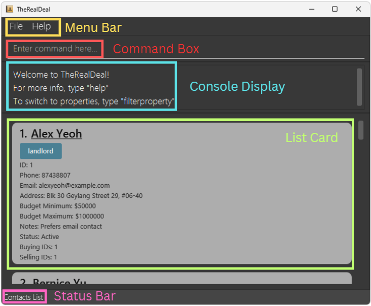
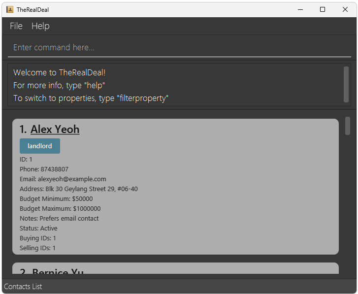

TheRealDeal is a **desktop application for real estate agents in Singapore, optimised for use via a Command Line Interface** (CLI) to streamline contact management by providing **quick access to contact preferences and available properties** within the local market. Dealing with Singaporean properties and clients, the app enables you to work efficiently - the faster you type, the faster TheRealDeal can help you find exactly what you need.

* Table of Contents
{:toc}

## Legend
These boxes in the User Guide has additional information that you should take note of.

**:information_source: Important:** 
Highlights important details to be aware of.

:bulb: **Tip:** 
Provides you with helpful advice like keyboard shortcuts to use the application more effectively.

:exclamation: **Caution:** 
Warns you of potential issues to should watch out for.

## GUI Overview

TheRealDeal Graphical User Interface (GUI) is organised into **five** key components:

* `Menu Bar`: Located at the top left, this includes options such as `File` and `Help` for managing settings and accessing support.
* `Command Box`: The main area where users can enter commands to interact with the app.
* `Console Display`: Provides immediate feedback, displaying success or failure messages based on the user’s command.
* `List Card`: Displays key information about contacts or properties, depending on the user's command.
* `Status Bar`: Displays whether contacts or properties are currently being shown.

## Quick start

1. Ensure you have `Java 17` or above installed in your Computer. 
   **Windows users:** Tutorial to download [here](https://se-education.org/guides/tutorials/javaInstallationWindows.html) 
   **Linux users:** Tutorial to download [here](https://se-education.org/guides/tutorials/javaInstallationLinux.html) 
   **Mac users:** Ensure you have the precise JDK version prescribed [here](https://se-education.org/guides/tutorials/javaInstallationMac.html).

2. Download the latest `TheRealDeal.jar` file from [here](https://github.com/AY2526S1-CS2103T-W10-2/tp/releases).  Note that the name of the file might differ based on the exact version installed.

3. Copy the file to the folder you want to use as the _home folder_ for TheRealDeal.

4. Open a command terminal, `cd` into the folder you put the jar file in, and use the  
   `java -jar (NAME_OF_FILE).jar` command to run the application.  
   A window similar to the picture below should appear in a few seconds. Note how the app contains some sample data. 

*Confused? Refer to [**Basic Command Terminal Navigation**](#basic-command-terminal-navigation) at the bottom of the user guide.*

:bulb: **Tip:** 
You can search for relevant information in the User Guide with this shortcut:  
Windows & Linux Users: <code>Ctrl + F</code> 
Mac Users: <code>⌘ + F</code>

Type a command in the command box and press Enter to execute it. e.g. typing `help` and pressing the `Enter` key on the keyboard will open the help window. 
Some example commands you can try:

* `list` : Lists all contacts.

* `addcontact n/John Doe p/98765432 e/johnd@example.com a/John street, block 123, #01-01` : Adds a contact named `John Doe` to the Address Book.

* `deletecontact 3` : Deletes the contact with ID: 3 shown in the current list.

* `clear` : Deletes all contacts and properties.

* `exit` : Exits the app.

To see the detailed explanation of every feature, click [here](#features) 
To see the summary of every feature, click [here](#command-summary)

## Features

**:information_source: Notes about the command format:** 

* Words in `UPPER_CASE` are the parameters to be supplied by the user. 
  e.g. in `addcontact n/NAME`, `NAME` is a parameter which can be used as `addcontact n/John Doe`.

* Items in square brackets are optional. 
  e.g `n/NAME [notes/TEXT]` can be used as `n/John Doe notes/VIP` or as `n/John Doe`.

* Items with `…`​ after them can be used multiple times. Items can be used zero times if they are also wrapped in square brackets. 
  e.g. `[c/ID]...` can be used as ` ` (i.e. 0 times), `c/1`, `c/1 c/2` etc. 
  e.g. `[n/NAME...]` can be used as ` ` (i.e. 0 times), `n/John`, `n/John Alex` etc.

* Parameters can be in any order. 
  e.g. if the command specifies `n/NAME p/PHONE_NUMBER`, `p/PHONE_NUMBER n/NAME` is also acceptable.

* Extraneous parameters for commands that do not take in parameters (such as `help`, `list`, `exit` and `clear`) will be ignored. 
  e.g. if the command specifies `help 123`, it will be interpreted as `help`.

* If you are using a PDF version of this document, be careful when copying and pasting commands that span multiple lines as space characters surrounding line-breaks may be omitted when copied over to the application.

### Viewing help : `help`

Opens a separate window containing the link to this User Guide.

Format: `help`

:bulb: **Tip:** 
You can also press the <code>F1</code> key to open the help window

Refer to [Command Summary](#command-summary) for the list of commands and their formats.

### Exiting the program : `exit`

Exits the program.

Format: `exit`

**:information_source: Important:** 
<code>exit</code> will also close any help windows that are open.

### List all contacts or properties: `list`

Resets any active filters of both contact list and property list.

Both contact and property cards display an ID field which represents the unique identifier of that contact or property.
This ID will be used for other commands.

Format: `list`

**:information_source: Important:** 
To switch to the list of contacts type: <code>filtercontact</code> 
To switch to the list of properties type: <code>filterproperty</code>

**List Command done while on Property List**

### Adding a contact : `addcontact`

Adds a new contact into the system.

Format: `addcontact n/NAME p/PHONE [e/EMAIL] [a/ADDRESS] [min/AMOUNT] [max/AMOUNT] [notes/TEXT] [status/STATUS]`

* Duplicate contacts (same phone number) will not be allowed to be added.
* Each new contact is assigned a unique ID automatically.

Examples:
* `addcontact n/Charlie p/91236789 a/982 Tampines Road status/active`
* `addcontact n/Xi Mi p/65738475 e/ximi@example.com min/800000 max/1000000`

**:information_source: Important:** 
If not provided, minimum budget will be $0 and maximum budget will be $200,000,000,000.  
If not provided, the other optional parameters (email, address, notes, status) will be empty. In other words, they will be ` `.

For more information on the parameters, click [here](#command-parameters).

### Editing a contact : `editcontact`

Edits an existing contact in the address book.

Format: `editcontact CONTACT_ID [n/NAME] [p/PHONE] [e/EMAIL] [a/ADDRESS] [min/AMOUNT] [max/AMOUNT] [notes/TEXT] [status/STATUS]`

* Edits the contact that has the `CONTACT_ID` as specified which refers to the ID number shown in the displayed contact list.
* At least one of the optional fields must be provided.
* If the newly edited contact matches an existing contact (same phone number), an error message will be shown.

Examples:
*  `editcontact 1 p/91234567 e/johndoe@example.com`
*  `editcontact 2 n/Betsy Crower`

**:information_source: Important:** 
You are able to edit valid contacts even if they are not currently shown on the GUI (but are stored in the address book).   
i.e. If you use <code>filtercontact</code> to remove a person from the GUI, you can still edit that person using <code>editcontact</code>.  
Use the <code>list</code> command to see the changes.

For more information on the parameters, click [here](#command-parameters).

### Filtering contacts : `filtercontact`

Filters the contacts based on the fields given.

Format: `filtercontact [n/NAME...] [p/PHONE...] [e/EMAIL...] [a/ADDRESS...] [min/AMOUNT] [max/AMOUNT] [notes/TEXT...] [status/STATUS...]`

* The search is case-insensitive. e.g `hans` will match `Hans`.
* Substring words will be matched e.g. `Bob` will match `Bobby`.
* Contacts matching any one of the keyword will be shown (meeting only one of the criteria is enough).
* Filtering is cumulative. Once you filter by name, you can filter by address subsequently.
* Filtering by minimum budget will show contacts with minimum budget more than or equals to the amount given
* Filtering by maximum budget will show contacts with maximum budget less than or equals to the amount given

Examples:
* `filtercontact a/yishun`
* `filtercontact n/Tan status/active inactive`

**:information_source: Important:** 
To reset all filters, you can type <code>list</code>

 

:bulb: **Tip:** 
To filter for: Name contains `Tan` and Address contains `Punggol` 
Type: `filtercontact n/Tan` followed by `filtercontact a/Punggol`  

To filter for: Name contains `Tan` or Address contains `Punggol` 
Type: `filtercontact n/Tan a/Punggol`  

To filter for: Address contains `Serangoon` or Address contains `Tampines` 
Type: `filtercontact a/Serangoon Tampines`

For more information on the parameters, click [here](#command-parameters).

### Deleting a contact : `deletecontact`

Deletes the specified contact from the address book.

Format: `deletecontact CONTACT_ID`

* Deletes the contact with the specified `CONTACT_ID`.
* The ID refers to the ID number of the contact shown in the displayed contact list.

Examples:
* `deletecontact 1`

:exclamation: **Caution:** 
<code>deletecontact</code> is irreversible! Please use it carefully as you will not be able to retrieve the contact back.

**:information_source: Important:** 
You are able to delete valid contacts even if they are not currently shown on the GUI (but are stored in the address book).   
i.e. If you use <code>filtercontact</code> to remove a person from the GUI, you can still delete that person using <code>deletecontact</code>.  
Use the <code>list</code> command to see the changes.

### Adding a property: `addproperty`

Adds a property to the property list.

Format: `addproperty a/ADDRESS p/POSTAL price/PRICE t/TYPE s/STATUS bed/BEDROOM bath/BATHROOM f/FLOOR_AREA o/CONTACT_ID`

* Duplicate properties (same address and postal code) will not be allowed to be added.
* Each new property is assigned a unique ID automatically.

Examples:
* `addproperty a/123 Orchard Rd p/238888 price/1950000 t/condo s/unavailable bed/3 bath/2 f/1023 o/1`
* `addproperty a/55 Pasir Ris Dr 1 p/519884 price/450000 t/hdb s/available bed/4 bath/2 f/1050 o/5`

For more information on the parameters, click [here](#command-parameters).

### Filtering properties : `filterproperty`

Filters the properties based on the fields given.

Format: `filterproperty [a/ADDRESS] [p/POSTAL] [price/PRICE] [t/TYPE] [s/STATUS] [bed/BEDROOM] [bath/BATHROOM] [f/FLOORAREA] [o/CONTACT_ID]`

* The search is case-insensitive. e.g `clementi` will match `Clementi`.
* Substring property addresses will be matched e.g. `Clementi` will match `CLementi Avenue 8`.
* Properties matching all the filters will be returned.
* Filtering is cumulative. Once you filter by type, you can filter by number of bathrooms subsequently.
* Filtering by price will show properties with price lesser than or equals to the price given. e.g. `filterproperty price/310000` will match all properties with price equal to or less than 3000
* Only one filter per field is accepted. e.g. `t/condo hdb` is not accepted.

Examples:
* `filterproperty a/yishun`
* `filterproperty bed/2 f/100`
  

**:information_source: Important:** 
To reset all filters, you can type <code>list</code>

:bulb: **Tip:** 
To filter for: Type is `HDB` and Address contains `Punggol` 
Type: `filterproperty t/hdb a/sengkang`  

For more information on the parameters, click [here](#command-parameters).

### Deleting a property: `deleteproperty`

Deletes a property identified by its unique ID.

Format: `deleteproperty PROPERTY_ID`

* Deletes the property with the specified `PROPERTY_ID`.
* The PROPERTY_ID refers to the ID number shown in the displayed property list.
* The command only works on properties currently visible in the property list panel. Use the [`list`](#list-all-contacts-or-properties-list) command first if needed.

Examples:
* `deleteproperty 12`
* `deleteproperty 3`

:exclamation: **Caution:** 
<code>deleteproperty</code> is irreversible! Please use it carefully as you will not be able to retrieve the property back.

### Mark property as sold : `sold`

Marks the status of the properties given as unavailable.

Format: `sold p/PROPERTY_ID...`

* `PROPERTY_ID` refers to the unique ID of the property shown in the property list.

Examples:
* `sold p/1`
* `sold p/2 p/3`

:exclamation: **Caution:** 
If one of the <code>PROPERTY_ID</code> given is invalid or the property is already marked as sold, the whole command is aborted.
The status of properties with valid <code>PROPERTY_ID</code> will not be changed.

For more information on the parameters, click [here](#command-parameters).

### Mark property as unsold : `unsold`

Marks the status of the properties given as available.

Format: `unsold p/PROPERTY_ID...`

* `PROPERTY_ID` refers to the unique ID of the property shown in the property list.

Examples:
* `unsold p/1`
* `unsold p/2 p/3`

:exclamation: **Caution:** 
If one of the <code>PROPERTY_ID</code> given is invalid or the property is already marked as unsold, the whole command is aborted.
The status of properties with valid <code>PROPERTY_ID</code> will not be changed.

For more information on the parameters, click [here](#command-parameters).

### Linking people and properties : `link`

Links people to properties as buyers or sellers by their IDs.

Format: `link c/CONTACT_ID... r/RELATIONSHIP p/PROPERTY_ID...`

* This command links all input contacts to all input properties by the relationship specified.  
* `RELATIONSHIP` **must be either `buyer` or `seller`**
* `CONTACT_ID` and `PROPERTY_ID` refer to the IDs of the people and properties being linked respectively.
* `link` can link any number of properties and people at once (excluding none).

Examples:
* `link c/10 r/buyer p/1 p/2`
* `link c/2 c/3 r/buyer p/3 p/5`

:exclamation: **Caution:** 
An error will be thrown if any of the following is attempted!  
1. Attempting to link a contact to a property as both a buyer and seller. 
2. Attempting to link a contact to a property marked as unavailable.

For more information on the parameters, click [here](#command-parameters).

### Unlinking people and properties : `unlink`

Unlinks people from properties as buyers and sellers, at the same time, by their IDs.

Format: `unlink c/CONTACT_ID... p/PROPERTY_ID...`

* `CONTACT_ID` and `PROPERTY_ID` refer to the IDs of the people and properties being linked respectively.
* `unlink` can unlink any number of properties and people at once (excluding none).

Examples:
* `unlink c/10 p/1 p/2`
* `unlink c/2 c/3 p/3 p/5`

For more information on the parameters, click [here](#command-parameters).

### Showing properties associated with a contact : `showproperties`

Displays all properties associated with a specific contact by their ID. Properties who either have the contact as a buyer, seller or owner, will be shown.

Format: `showproperties CONTACT_ID`

* `CONTACT_ID` refers to the unique ID of the contact shown in the contact list.
* The view automatically switches to show the property list.

Examples:
* `showproperties 1`
* `showproperties 123`

### Showing contacts associated with a property : `showcontacts`

Displays all contacts associated with a specific property by their unique IDs.

Format: `showcontacts PROPERTY_ID`

* `PROPERTY_ID` refers to the unique ID of the property shown in the property list. Contacts who either are buying, selling or is an owner of the property will be shown.
* The view automatically switches to show the contact list.

Examples:
* `showcontacts 1`
* `showcontacts 12`

For more information on the parameters, click [here](#command-parameters).

### Clearing all entries : `clear`

Clears ***ALL*** contacts and properties from the application.

Format: `clear`

:exclamation: **Caution:** 
<code>clear</code> is irreversible! Please use it carefully as you will not be able to retrieve the data back.

**Expected Output** 

## Saving the data

TheRealDeal data is saved in the hard disk automatically after any command that changes the data. There is no need to save manually.

## Editing the data file

TheRealDeal data is saved automatically as two JSON files
1. `[JAR file location]/data/addressbook.json`
2. `[JAR file location]/data/propertybook.json`

Advanced users are welcome to update data directly by editing that data file.

:exclamation: **Caution:**
If your changes to the data file makes its format invalid, TheRealDeal will discard all data and start with an empty data file at the next run. Hence, it is recommended to take a backup of the file before editing it.  
Furthermore, certain edits can cause the TheRealDeal to behave in unexpected ways (e.g., if a value entered is outside of the acceptable range). Therefore, edit the data file only if you are confident that you can update it correctly.

## FAQ

**Q**: How do I transfer my data to another Computer? 
**A**: Install the application in the other computer and overwrite the empty data file it creates with the file that contains the data of your previous TheRealDeal home folder.
  
**Q**: Does TheRealDeal require internet connection? 
**A**: The application will only require internet connection if you want to access the User Guide. Every other command works without internet connection.
  
**Q**: Where is the data for TheRealDeal stored? 
**A**: Refer to [this](#editing-the-data-file) section to learn more.
  
**Q**: How do I back up my data? 
**A**: You can save a copy of the `addressbook.json` and `propertybook.json` to a back up location.
  
**Q**: Why isn't my command working for a contact/property that I have already input? 
**A**: Ensure that the contact/property you are affecting with the command is visible on the GUI.

## Known issues

1. **When using multiple screens**, if you move the application to a secondary screen, and later switch to using only the primary screen, the GUI will open off-screen. The remedy is to delete the `preferences.json` file created by the application before running the application again.

2. **If you minimise the Help Window** and then run the `help` command (or use the `Help` menu, or the keyboard shortcut `F1`) again, the original Help Window will remain minimised, and no new Help Window will appear. The remedy is to manually restore the minimised Help Window.

3. **Contact names do not support special characters.** The current validation for contact names requires it to only consist of alphanumeric characters and spaces. The does not support names with special characters like `/` or `-` (e.g. `s/o`, `John-Mary`). This becomes a drawback for property agents who wish to store their contacts full name. The current workaround will be to only use alphanumeric characters (e.g. `son of` instead of `s/o`). Future improvements aim to support this functionality.

4. **There is no verification of inputs for phone number and postal code to meet Singapore format.** Currently, postal codes like `000000` or phone numbers like `000000` are accepted by the application. This becomes a drawback as the user is not informed if they made a typo (e.g. phone number `084123492`). Further improvements aim to support verification of inputs.

5. **Deleting a contact does not update the owner data of properties.** Future improvements aim to automatically update the owner when the contact is deleted.  

6. **Filtering logic for filter contacts and filter property are different.** Future improvements aim to make them work similarly for clarity.

--------------------------------------------------------------------------------------------------------------------

## Command summary
To see the detailed explanation of every feature, click [here](#features) 

| Action                      | Format, Examples                                                                                                                                                                                                                      |
|-----------------------------|---------------------------------------------------------------------------------------------------------------------------------------------------------------------------------------------------------------------------------------|
| **Add Contact**             | `addcontact n/NAME p/PHONE [e/EMAIL] [a/ADDRESS] [min/AMOUNT] [max/AMOUNT] [notes/TEXT] [status/STATUS]`     e.g., `addcontact n/Alex p/91423123 a/982 Yishun Road status/active notes/wants near school min/100000 max/300000` |
| **Edit Contact**            | `editcontact ID [n/NAME] [p/PHONE] [e/EMAIL] [a/ADDRESS] [min/AMOUNT] [max/AMOUNT] [notes/TEXT] [status/STATUS]`    e.g.,`editcontact 2 n/Bobby a/Block 321 Punggol`                                                            |
| **Filter Contact**          | `filtercontact [n/NAME] [p/PHONE] [e/EMAIL] [a/ADDRESS] [min/AMOUNT] [max/AMOUNT] [notes/TEXT] [status/STATUS]`    e.g.,`filtercontact n/Tan status/active`                                                                     |
| **Delete Contact**          | `deletecontact ID`    e.g., `deletecontact 3`                                                                                                                                                                                   |
| **Add Property**            | `addproperty a/ADDRESS p/POSTAL price/PRICE t/TYPE s/STATUS bed/BEDROOM bath/BATHROOM f/FLOOR_AREA o/CONTACT_ID`    e.g., `addproperty a/123 Orchard Rd p/238888 price/1950000 t/condo s/unavailable bed/3 bath/2 f/1023 o/1`   |
| **Filter Property**         | `filterproperty [a/ADDRESS] [p/POSTAL] [price/PRICE] [t/TYPE] [s/STATUS] [bed/BEDROOM] [bath/BATHROOM] [f/FLOORAREA] [o/CONTACT_ID]`    e.g., `filterproperty bed/2 price/2000`                                                 |
| **Delete Property**         | `deleteproperty ID`     e.g., `deleteproperty 12`                                                                                                                                                                               |
| **Mark Property as Sold**   | `sold p/ID...`    e.g. `sold p/1 p/2`                                                                                                                                                                                           |
| **Mark Property as Unsold** | `unsold p/ID...`    e.g. `unsold p/2 p/3`                                                                                                                                                                                       |
| **Link**                    | `link c/CONTACT_ID... r/RELATIONSHIP p/PROPERTY_ID...`     e.g., `link c/12 r/buyer p/12 p/4`                                                                                                                                   |
| **Unlink**                  | `unlink c/CONTACT_ID... p/PROPERTY_ID...`    e.g., `unlink c/1 p/14 c/2`                                                                                                                                                        |
| **Show linked properties**  | `showproperties CONTACT_ID`     e.g., `showproperties 2`                                                                                                                                                                        |
| **Show linked contacts**    | `showcontacts PROPERTY_ID`    e.g., `showcontacts 3`                                                                                                                                                                            |
| **List**                    | `list`                                                                                                                                                                                                                                |
| **Clear**                   | `clear`                                                                                                                                                                                                                               |
| **Help**                    | `help`                                                                                                                                                                                                                                |

--------------------------------------------------------------------------------------------------------------------

## Command Parameters
This table shows every parameter and prefix used in TheRealDeal.

**:information_source: Important:** 
If the command states that the prefix is optional e.g. <code>n/NAME [notes/TEXT]</code> 
an empty parameter will be the same as not having the prefix 
e.g. <code>n/NAME notes/</code> is the same as <code>n/NAME</code>  
All parameters that expect integers must be entered as **plain digits** (0-9) — without commas, dots, spaces, or any other separators.

### Contact Management
These are prefixes for purely contact related commands.
Related commands: [`addcontact`](#adding-a-contact--addcontact), [`filtercontact`](#filtering-contacts--filtercontact), [`editcontact`](#editing-a-contact--editcontact)

| Parameter      | Prefix  | Constraints                                                                                                                 |
|----------------|---------|-----------------------------------------------------------------------------------------------------------------------------|
| Name           | n/      | Should only contain alphabetical characters (a-z, A-Z) or spaces                                                            |
| Phone Number   | p/      | Should only contain numbers (0-9), and it should be at least 3 digits long                                                  |
| Email          | e/      | Should follow the format: name@example.com                                                                                  |
| Address        | a/      | Can take any value. Maximum of 200 characters                                                                               |
| Minimum Budget | min/    | Should be a non-negative integer. If not provided, will have a default of $0                                                |
| Maximum Budget | max/    | Should be a non-negative integer and more than the minimum budget. If not provided, will have a default of $200,000,000,000 |
| Notes          | notes/  | Can take any value. Maximum of 500 characters                                                                               |
| Status         | status/ | Should only be these (case-insensitive): active, inactive                                                                   |

### Property Management
These are prefixes for purely property related commands.
Related commands: [`addproperty`](#adding-a-property-addproperty), [`filterproperty`](#filtering-properties--filterproperty)

| Parameter      | Prefix | Constraints                                                                                                          |
|----------------|--------|----------------------------------------------------------------------------------------------------------------------|
| Address        | a/     | Should only contain alphanumerical 5 to 200 characters (a-z, A-Z, 0-9) or spaces, with at least 1 letter and 1 digit |
| Postal code    | p/     | Should only contain numbers (0-9), and it should be exactly least 6 digits long. (Singaporean Postal Code)           |
| Price          | price/ | Should be an integer from 1 to 1 trillion                                                                            |
| Type           | t/     | Should only be these (case-insensitive): hdb, condo, landed, apartment, office, others                               |
| Status         | s/     | Should only be these (case-insensitive): available, unavailable                                                      |
| Bedroom count  | bed/   | Should be an integer from 0 to 20                                                                                    |
| Bathroom count | bath/  | Should be an integer from 0 to 20                                                                                    |
| Floor area     | f/     | Should be an integer from 50 to 100000                                                                               |
| Owner ID       | o/     | Should be a valid Contact ID                                                                                         |

### Others
These are prefixes that are used over multiple commands.
Related commands: [`filtercontact`](#filtering-contacts--filtercontact), [`filterproperty`](#filtering-properties--filterproperty), [`sold`](#mark-property-as-sold--sold), [`unsold`](#mark-property-as-unsold--unsold), [`link`](#linking-people-and-properties--link), [`unlink`](#unlinking-people-and-properties--unlink), [`showproperties`](#showing-properties-associated-with-a-contact--showproperties), [`showcontacts`](#showing-contacts-associated-with-a-property--showcontacts)

| Parameter     | Prefix  | Constraints                                            |
|---------------|---------|--------------------------------------------------------|
| Contact ID    | c/      | Should be a valid Contact ID                           |
| Property ID   | p/      | Should be a valid Property ID                          |
| Relationship  | r/      | Should only be these (case-insensitive): buyer, seller |

## Basic Command Terminal Navigation
1. Determine the address of the folder where TheRealDeal is installed.  
2. Open "Powershell" on Windows or "Terminal" on MacOS and Linux.  
3. Type `cd ADDRESS`, where `ADDRESS` is the address where TheRealDeal is installed (e.g. `cd C:\Users\home\Desktop\TheRealDeal`), and press the `Enter` key.  
4. Type `java -jar (NAME_OF_FILE).jar`, and press the `Enter` key to run the application. Replace `(NAME_OF_FILE)` with the name of the file downloaded. Note that the name of the file might differ based on the exact version installed.  

## Glossary of Terms

| Term            | Definition                                                                                                                                                                                                                                                                                                             |
|-----------------|------------------------------------------------------------------------------------------------------------------------------------------------------------------------------------------------------------------------------------------------------------------------------------------------------------------------|
| **CLI**         | Command Line Interface (CLI) is an interface where the user interacts with the application via directly typed commands.                                                                                                                                                                                                |
| **GUI**         | Graphical User Interface (GUI) is a visual interface that users can interact with.                                                                                                                                                                                                                                     |
| **ID**          | A unique identifier of a contact or a property. It is generated by the application and can be referenced from the application.                                                                                                                                                                                         |
| **Contact**     | A contact whose details are stored in the system. The contact can either be a buyer or seller.                                                                                                                                                                                                                         |
| **Property**    | A building whose details are stored in the system. The building can either be a HDB, condominium, landed, apartment or office.                                                                                                                                                                                         |
| **JSON**        | JavaScript Object Notation (JSON) is a text-based data storage format that is used to store the data of the application.                                                                                                                                                                                               |
| **Buyer**       | A contact who is interested in purchasing a property. Multiple buyers can be linked to the same property to track all interested parties during negotiations. Being linked as a buyer indicates interest, not completed purchase. Use the `sold` command to mark a property as unavailable once the sale is finalised. |
| **Seller**      | A contact who is offering a property for sale. Sellers can be linked to properties they wish to sell.                                                                                                                                                                                                                  |
| **Owner**       | The contact who legally owns a property. Each property must have exactly one owner assigned via the o/ parameter                                                                                                                                                                                                       |
| **Sold**        | Refers to a property that has been successfully sold and is no longer available. Properties marked as sold have their status set to "unavailable".                                                                                                                                                                     |
| **Unsold**      | Refers to a property that is currently available for sale. Properties marked as unsold have their status set to "available".                                                                                                                                                                                           |
| **Available**   | A property status indicating the property is currently on the market and can be sold.                                                                                                                                                                                                                                  |
| **Unavailable** | A property status indicating the property has been sold and is no longer on the market.                                                                                                                                                                                                                                |
| **Active**      | A contact status indicating the contact is currently engaged and actively working with the agent.                                                                                                                                                                                                                      |
| **Inactive**    | A contact status indicating the contact is not currently engaged with the agent or has paused their property search                                                                                                                                                                                                    |
